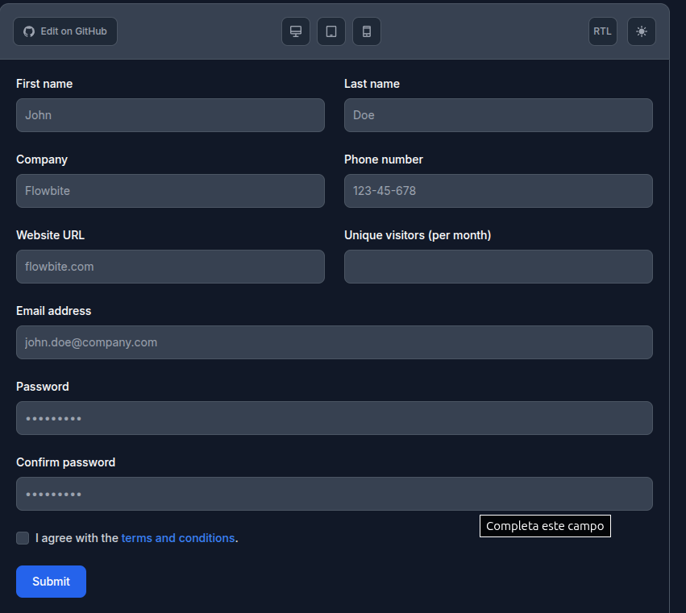

# Grid

El grid se basa en [Tailwind CSS Input Field - Flowbite](https://flowbite.com/docs/forms/input-field/)




Define un elemento de dos columnas por fila. 


```html

 <form>
    <div class="grid gap-6 mb-6 md:grid-cols-2">
        <div>
            <label for="first_name" class="block mb-2 text-sm font-medium text-gray-900 dark:text-white">First name</label>
            <input type="text" id="first_name" class="bg-gray-50 border border-gray-300 text-gray-900 text-sm rounded-lg focus:ring-blue-500 focus:border-blue-500 block w-full p-2.5 dark:bg-gray-700 dark:border-gray-600 dark:placeholder-gray-400 dark:text-white dark:focus:ring-blue-500 dark:focus:border-blue-500" placeholder="John" required />
        </div>
        <div>
            <label for="last_name" class="block mb-2 text-sm font-medium text-gray-900 dark:text-white">Last name</label>
            <input type="text" id="last_name" class="bg-gray-50 border border-gray-300 text-gray-900 text-sm rounded-lg focus:ring-blue-500 focus:border-blue-500 block w-full p-2.5 dark:bg-gray-700 dark:border-gray-600 dark:placeholder-gray-400 dark:text-white dark:focus:ring-blue-500 dark:focus:border-blue-500" placeholder="Doe" required />
        </div>
        <div>
            <label for="company" class="block mb-2 text-sm font-medium text-gray-900 dark:text-white">Company</label>
            <input type="text" id="company" class="bg-gray-50 border border-gray-300 text-gray-900 text-sm rounded-lg focus:ring-blue-500 focus:border-blue-500 block w-full p-2.5 dark:bg-gray-700 dark:border-gray-600 dark:placeholder-gray-400 dark:text-white dark:focus:ring-blue-500 dark:focus:border-blue-500" placeholder="Flowbite" required />
        </div>  
        <div>
            <label for="phone" class="block mb-2 text-sm font-medium text-gray-900 dark:text-white">Phone number</label>
            <input type="tel" id="phone" class="bg-gray-50 border border-gray-300 text-gray-900 text-sm rounded-lg focus:ring-blue-500 focus:border-blue-500 block w-full p-2.5 dark:bg-gray-700 dark:border-gray-600 dark:placeholder-gray-400 dark:text-white dark:focus:ring-blue-500 dark:focus:border-blue-500" placeholder="123-45-678" pattern="[0-9]{3}-[0-9]{2}-[0-9]{3}" required />
        </div>
        <div>
            <label for="website" class="block mb-2 text-sm font-medium text-gray-900 dark:text-white">Website URL</label>
            <input type="url" id="website" class="bg-gray-50 border border-gray-300 text-gray-900 text-sm rounded-lg focus:ring-blue-500 focus:border-blue-500 block w-full p-2.5 dark:bg-gray-700 dark:border-gray-600 dark:placeholder-gray-400 dark:text-white dark:focus:ring-blue-500 dark:focus:border-blue-500" placeholder="flowbite.com" required />
        </div>
        <div>
            <label for="visitors" class="block mb-2 text-sm font-medium text-gray-900 dark:text-white">Unique visitors (per month)</label>
            <input type="number" id="visitors" class="bg-gray-50 border border-gray-300 text-gray-900 text-sm rounded-lg focus:ring-blue-500 focus:border-blue-500 block w-full p-2.5 dark:bg-gray-700 dark:border-gray-600 dark:placeholder-gray-400 dark:text-white dark:focus:ring-blue-500 dark:focus:border-blue-500" placeholder="" required />
        </div>
    </div>


 
</form>


```


Se usa en conjunto con [GridCol](gridCol.md) e [GridColCss](gridColCss.md)


Por ejemplo

```java
Form mainForm = new Form().id("mainForm")

Grid grid = new Grid();
            grid.add(new GridCol("Fecha de Registro", "fechaRegistro", "fechaRegistro", TypeInput.DATE));
            grid.add(new GridCol("Fecha de Registro3", "fechaRegistro3", "fechaRegistro3", TypeInput.DATE));

            grid.add(new GridCol(
                    new Label("Apellido", GridColCss.Label.css, "apellido"),
                    new InputText("apellido", "apellido", GridColCss.Input.css).required(Boolean.TRUE)));
            grid.add(new GridCol(
                    new Label("Salario", GridColCss.Label.css, "salario"),
                    new InputText("salario", "salario", GridColCss.Input.css).required(Boolean.TRUE)));

            mainForm.add(grid);
```

Genera


