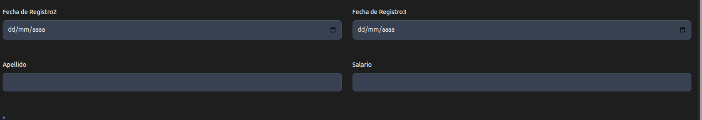

# GridCol

Se usan como un componente para un [Grid](grid.md) e [GridColCss](gridColCss.md)

```java

 Grid grid = new Grid();
            grid.add(new GridCol("Fecha de Registro", "fechaRegistro", "fechaRegistro", TypeInput.DATE));
            grid.add(new GridCol("Fecha de Registro3", "fechaRegistro3", "fechaRegistro3", TypeInput.DATE));

            grid.add(new GridCol(
                    new Label("Apellido", GridColCss.Label.css, "apellido"),
                    new InputText("apellido", "apellido", GridColCss.Input.css).required(Boolean.TRUE)));
            grid.add(new GridCol(
                    new Label("Salario", GridColCss.Label.css, "salario"),
                    new InputText("salario", "salario", GridColCss.Input.css).required(Boolean.TRUE)));

            mainForm.add(grid);


```




La clase GridCol tiene los siguientes constructores

```java

public GridCol(String label, String idAndName)

public GridCol(String label, String id, String name)

public GridCol(Label label, Tag input)

public GridCol(String label, String id, String name, TypeInput typeInput)

GridCol(String label, String id, String name, TypeInput typeInput, Boolean required, Boolean readonly)

```