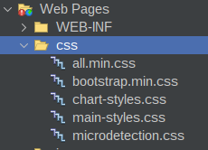

# CSS

Usar Archivos CSS Propios (Archivos de Recursos Estáticos)

Si deseas añadir tus propios estilos personalizados o incluir el archivo Bootstrap directamente en tu aplicación:

Crea una carpeta de recursos: Coloca tu archivo CSS (ej. estilos.css) dentro de la carpeta src/main/webapp/css/.




```java
Link link = new Link().rel("stylesheet").href(request.getContextPath() + "/css/estilos.css");
```

El método request.getContextPath() asegura que la ruta al archivo CSS sea correcta, independientemente de cómo se despliegue tu aplicación Jakarta EE.


## Usarlo en un View

Obtenga el contextPath del request y añada la ruta del archivo.

```java
public class AnalisisView extends JettraView {
    // <editor-fold defaultstate="collapsed" desc="attributes()">

    WebModelSession webModelSession = new WebModelSession();
    List<Tag> headers = new ArrayList<>();
    @Inject
    ConfigurationProperties configurationProperties;
// </editor-fold>

    @Override
    protected String init() {
        webModelSession = webModelOfSession(request);
        String contextPath = request.getContextPath();
        headers.add(new Tag("link").withAttribute("rel", "stylesheet").withAttribute("href", contextPath + "/css/microdetection.css"));

        return DashboardLayout.buildPage(
                request,
                webModelSession.getUsername(),
                content(request),
                MenuSideBar.getSidebarSections(
                        this.getClass().getSimpleName(),
                        webModelSession
                ),
                "Profile View",
                configurationProperties.getDashboardFooterText() + " | " + webModelSession.getUserRol(),
                headers
        );
    }
```
