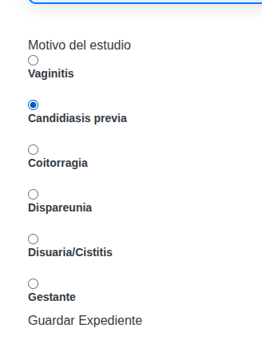

#  Fieldset




Basado en [<fieldset>: The Field Set element](https://developer.mozilla.org/en-US/docs/Web/HTML/Reference/Elements/fieldset=)

Generalmente lo usamos añadiendolo a un [Div](div.md)` para que sea un titulo de una seccion

Lo usamos un [Radio](radio.md)

```java

String labelClass = "block text-gray-700 text-sm font-bold mb-2 dark:text-white";
String inputClass = "shadow appearance-none border rounded w-full py-2 px-3 text-gray-700 leading-tight focus:outline-none focus:shadow-outline dark:bg-gray-700 dark:border-gray-600 dark:text-white";

 Div divReasonSection = new Div().id("reason-section")
                    .add(new FieldSet().text("Motivo del estudio"))
                    .add(
                            new Div().addClass("radio-group-container two-columns")
                                    .add(
                                            new Div().addClass("radio-item")
                                                    .add(new InputRadio().id("motivo1").name("motivo").required(Boolean.TRUE).value("Vaginitis"))
                                                    .add(new Label().forField("motivo1").text("Vaginitis").addClass(labelClass))
                                    )
                                    .add(
                                            new Div().addClass("radio-item")
                                                    .add(new InputRadio().id("motivo2").name("motivo").required(Boolean.TRUE).value("Candidiasis previa"))
                                                    .add(new Label().forField("motivo2").text("Candidiasis previa").addClass(labelClass))
                                    )
                                    .add(
                                            new Div().addClass("radio-item")
                                                    .add(new InputRadio().id("motivo3").name("motivo").required(Boolean.TRUE).value("Coitorragia"))
                                                    .add(new Label().forField("motivo3").text("Coitorragia").addClass(labelClass))
                                    )
                                    .add(
                                            new Div().addClass("radio-item")
                                                    .add(new InputRadio().id("motivo4").name("motivo").required(Boolean.TRUE).value("Dispareunia"))
                                                    .add(new Label().forField("motivo4").text("Dispareunia").addClass(labelClass))
                                    )
                                    .add(
                                            new Div().addClass("radio-item")
                                                    .add(new InputRadio().id("motivo5").name("motivo").required(Boolean.TRUE).value("Disuaria/Cistitis"))
                                                    .add(new Label().forField("motivo5").text("Disuaria/Cistitis").addClass(labelClass))
                                    )
                                    .add(
                                            new Div().addClass("radio-item")
                                                    .add(new InputRadio().id("motivo6").name("motivo").required(Boolean.TRUE).value("Gestante"))
                                                    .add(new Label().forField("motivo6").text("Gestante").addClass(labelClass))
                                    )
                    );


``