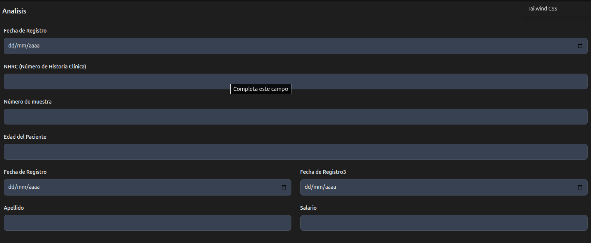

# Form

Muestra como crear un formulario con componentes. 

Recuerde que para un diseño mas facil puede usar [FormRow](formRow.md) y [Grid](grid.md)

Este diseño se basa en [Tailwind CSS Input Field - Flowbite](https://flowbite.com/docs/forms/input-field/)




Genera un formulario html

```java
   Form mainForm = new Form().id("mainForm")
                    .add(new FormRow("Fecha de Registro", "fechaRegistro", "fechaRegistro", TypeInput.DATE))
                    .add(new FormRow("NHRC (Número de Historia Clínica)", "nhrc", "nhrc", TypeInput.TEXT, Boolean.TRUE, Boolean.FALSE))
                    .add(new FormRow("Número de muestra", "numeromuestra", "numeromuestra", TypeInput.TEXT, Boolean.TRUE, Boolean.FALSE))
                    .add(new FormRow("Edad del Paciente", "edad", "edad", TypeInput.NUMBER, Boolean.TRUE, Boolean.FALSE));

            Grid grid = new Grid();
            grid.add(new GridCol("Fecha de Registro", "fechaRegistro", "fechaRegistro", TypeInput.DATE));
            grid.add(new GridCol("Fecha de Registro3", "fechaRegistro3", "fechaRegistro3", TypeInput.DATE));

            grid.add(new GridCol(
                    new Label("Apellido", GridColCss.Label.css, "apellido"),
                    new InputText("apellido", "apellido", GridColCss.Input.css).required(Boolean.TRUE)));
            grid.add(new GridCol(
                    new Label("Salario", GridColCss.Label.css, "salario"),
                    new InputText("salario", "salario", GridColCss.Input.css).required(Boolean.TRUE)));

            mainForm.add(grid);


```


