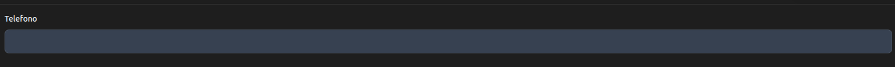
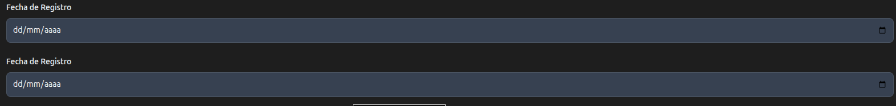

# inputRow

Un inputRow genera componentes Flowbite para  [Tailwind CSS Input Field - Flowbite](https://flowbite.com/docs/forms/input-field/)


```html
<form>

<div class="mb-6">
        <label for="email" class="block mb-2 text-sm font-medium text-gray-900 dark:text-white">Email address</label>
        <input type="email" id="email" class="bg-gray-50 border border-gray-300 text-gray-900 text-sm rounded-lg focus:ring-blue-500 focus:border-blue-500 block w-full p-2.5 dark:bg-gray-700 dark:border-gray-600 dark:placeholder-gray-400 dark:text-white dark:focus:ring-blue-500 dark:focus:border-blue-500" placeholder="john.doe@company.com" required />
    </div> 
    <div class="mb-6">
        <label for="password" class="block mb-2 text-sm font-medium text-gray-900 dark:text-white">Password</label>
        <input type="password" id="password" class="bg-gray-50 border border-gray-300 text-gray-900 text-sm rounded-lg focus:ring-blue-500 focus:border-blue-500 block w-full p-2.5 dark:bg-gray-700 dark:border-gray-600 dark:placeholder-gray-400 dark:text-white dark:focus:ring-blue-500 dark:focus:border-blue-500" placeholder="•••••••••" required />
    </div> 
</form>


```


La clase InputRow tiene los siguientes constructores

```java

// Genera el mismo nombre para el id y name

public InputRow(String label, String idAndName)

// Id y name Diferente

public InputRow(String label, String id, String name)  


public InputRow(String label, String id, String name, TypeInput typeInput)

public InputRow(String label, String id, String name, TypeInput typeInput, Boolean required, Boolean readonly) 

```

El enum TypeInput posee los siguientes valores

```java
public enum TypeInput {
   TEXT,NUMBER,PASSWORD,COLOR,DATE,EMAIL,FILE, HIDDEN,RADIO, RANGE,SEARCH,TIME
}


```


* InputText

 Genera una caja de texto para un numero de telefono

```java

.add(new InputRow("Telefono","telefono"))


```




* Text

Usando InputRow

```java
  Form mainForm = new Form().id("mainForm")
 .add(new InputRow("NHRC (Número de Historia Clínica)","nhrc", "nhrc", TypeInput.TEXT, Boolean.TRUE, Boolean.FALSE))


```

Sin usar InputRow

```java
  Form mainForm = new Form().id("mainForm")
    .add(new Div("mb-6")
                            .add(new Label("NHRC (Número de Historia Clínica)", labelClass, "nhrc"))
                            .add(new InputText("nhrc", "nhrc", inputClass).required(Boolean.TRUE))
                    )


```


* Fechas

```java

 Form mainForm = new Form().id("mainForm")
      .add(new InputRow("Fecha de Registro", "fechaRegistro", "fechaRegistro", TypeInput.DATE))


```





Sin usar InputRow lo haria de la siguiente manera

```java
 String labelClass = "block mb-2 text-sm font-medium text-gray-900 dark:text-white";
String inputClass = "bg-gray-50 border border-gray-300 text-gray-900 text-sm rounded-lg focus:ring-blue-500 focus:border-blue-500 block w-full p-2.5 dark:bg-gray-700 dark:border-gray-600 dark:placeholder-gray-400 dark:text-white dark:focus:ring-blue-500 dark:focus:border-blue-500";


 Form mainForm = new Form().id("mainForm")
               .add(new InputRow("Fecha de Registro", "fechaRegistro", "fechaRegistro", TypeInput.DATE))
               .add(new Div("mb-6")
               .add(new Label("Fecha de Registro", labelClass, "fechaRegistro"))
               .add(new InputDate("fechaRegistro", "fechaRegistro", inputClass).required(Boolean.TRUE))
                )

```
