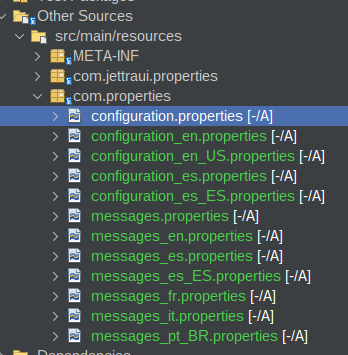
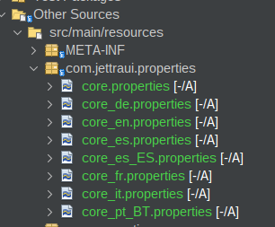

# Archivos Properties

Por defecto puede usar los archivos

Pasos:

1. En Other Sources cree la carpeta com.properties
2. Cree el archivo configuration.properties
3. Cree el archivo messages.properties





De manera predeterminada el framework ofrece el archivo  com.jettraui.properties

No tiene que crearlo.



Para usarlo

```java

 @Inject
 JettraResourcesFiles jettraResourcesFiles;


```

Integrarlo

```java

@Override
protected String init() {

   String message = jettraResourcesFiles.fromMessage("menubar.home");
   System.out.println("\tmessages.properties <bar.home> " + message);

   String core = jettraResourcesFiles.fromCore("button.add");
   System.out.println("\tcore.properties<button.add> " + core);

   String configuration = jettraResourcesFiles.fromConfiguration("application.title");
   System.out.println("\tconfiguration.properties<application.title> " + configuration);
}

```