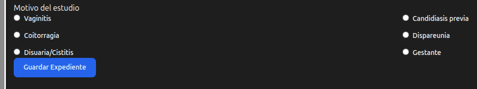
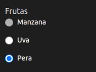
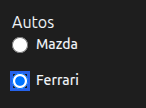
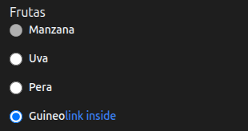
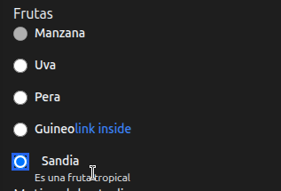
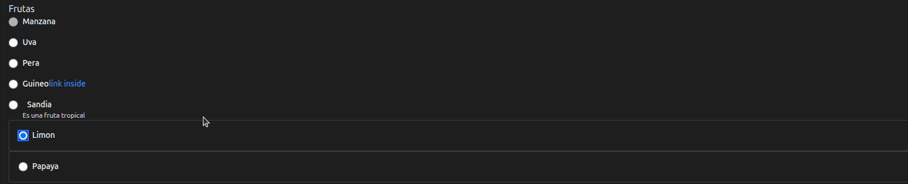
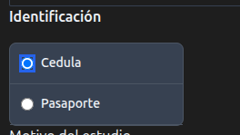
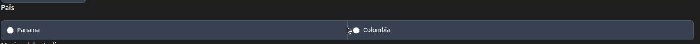

# Radio 

Nos basarems en el componente [Tailwind CSS Radio - Flowbite](https://flowbite.com/docs/forms/radio/)

## Usando Secciones Div con Dos Columnas

En este ejemplo lo definimos mediante componentes [DIV](div.md), [RadioItem](radioitem.md), [Label](label.md), [RadioCss](radiocss.md)


Para usar dos columnas necesita agregar el archivo radio.css al header , en la sección init

mediante  **headers.add(new Link().rel("stylesheet").href(request.getContextPath() + "/css/radio.css"));**

Observe que los elementos RadioItem el id es diferente, pero el name debe ser el mismo para todos.


Ejemplo

```java
@Override
protected String init() {
    webModelSession = webModelOfSession(request);

    headers.add(new Link().rel("stylesheet").href(request.getContextPath() + "/css/radio.css"));

    return DashboardLayout.buildPage(
            request,
            webModelSession.getUsername(),
            content(request),
            MenuSideBar.getSidebarSections(
                    this.getClass().getSimpleName(),
                    webModelSession
            ),
            "Profile View",
            configurationProperties.getDashboardFooterText() + " | " + webModelSession.getUserRol(),
            headers
    );
}

```

Implementacion

```java

Div divReasonSection = new Div().id("reason-section")
.add(new FieldSet().text("Motivo del estudio"))
.add(
    new Div().addClass("radio-group-container two-columns")
        .add(
            new Div().addClass("radio-item")
                    .add(new RadioItem().id("motivo1").name("motivo").required(Boolean.TRUE).value("Vaginitis"))
                    .add(new Label().forField("motivo1").text("Vaginitis").addClass(RadioCss.Label.css))
        )
        .add(
            new Div().addClass("radio-item")
                    .add(new RadioItem().id("motivo2").name("motivo").required(Boolean.TRUE).value("Candidiasis previa"))
                    .add(new Label().forField("motivo2").text("Candidiasis previa").addClass(RadioCss.Label.css))
        )
        .add(
            new Div().addClass("radio-item")
                    .add(new RadioItem().id("motivo3").name("motivo").required(Boolean.TRUE).value("Coitorragia"))
                    .add(new Label().forField("motivo3").text("Coitorragia").addClass(RadioCss.Label.css))
        )
        .add(
            new Div().addClass("radio-item")
                    .add(new RadioItem().id("motivo4").name("motivo").required(Boolean.TRUE).value("Dispareunia"))
                    .add(new Label().forField("motivo4").text("Dispareunia").addClass(RadioCss.Label.css))
        )
        .add(
            new Div().addClass("radio-item")
                    .add(new RadioItem().id("motivo5").name("motivo").required(Boolean.TRUE).value("Disuaria/Cistitis"))
                    .add(new Label().forField("motivo5").text("Disuaria/Cistitis").addClass(RadioCss.Label.css))
        )
        .add(
            new Div().addClass("radio-item")
                    .add(new RadioItem().id("motivo6").name("motivo").required(Boolean.TRUE).value("Gestante"))
                    .add(new Label().forField("motivo6").text("Gestante").addClass(RadioCss.Label.css))
        )
);
    mainForm.add(divReasonSection);

```

Genera 




## Usando Radio

Usando elemento de Radio vea [RadioItem](radioitem.md) se puede ver los detalles de desabilitar y elementos por defecto.

* Muestra el uso de disabled, checked

```java
H3 h3 = new H3("Frutas");
Radio radioManzana = new Radio()
        .add(new RadioItem("manzana", "frutas", RadioCss.Input.css).disabled(Boolean.TRUE))
        .add(new Label("Manzana", RadioCss.Label.css, "manzana"));

Radio radioUva = new Radio()
        .add(new RadioItem("uva", "frutas", RadioCss.Input.css).checked(Boolean.TRUE))
        .add(new Label("Uva", RadioCss.Label.css, "uva"));
Radio radioPera = new Radio()
        .add(new RadioItem("pera", "frutas", RadioCss.Input.css).checked(Boolean.TRUE))
        .add(new Label("Pera", RadioCss.Label.css, "pera"));

mainForm.add(h3);
mainForm.add(radioManzana);
mainForm.add(radioUva);
mainForm.add(radioPera);
```



## Usando Div Simplificado con **RadioCss.Div.css**, [RadioCss](radiocss.md)

```java
 H3 h3Autos = new H3("Autos");

Div divMazda = new Div(RadioCss.Div.css)
        .add(new RadioItem("mazda", "autos", RadioCss.Input.css))
        .add(new Label("Mazda", RadioCss.Label.css, "mazda"));
Div divFerrari = new Div("flex items-center mb-4")
        .add(new RadioItem("ferrari", "autos", RadioCss.Input.css))
        .add(new Label("Ferrari", RadioCss.Label.css, "ferrari"));


mainForm.add(h3Autos);
mainForm.add(divMazda);
mainForm.add(divFerrari);
```



## Radio Link

Añada el Label **new RadioItemLink("#","link inside")**

```java
Radio radioLink= new Radio()
    .add(new RadioItem("guineo", "frutas", RadioCss.Input.css )
            .checked(Boolean.TRUE)
            )
    .add(new Label("Guineo", RadioCss.Label.css, "guineo",new RadioItemLink("#","link inside")));

```



## Helper Text

Permite agregar un texto explicativo a la opción de  Radio.
Recibe como parametros un RadioItem, Label y el texto de Ayuda.

```java
RadioItem radioItemSandia = new RadioItem("sandia", "frutas", RadioCss.Input.css).checked(Boolean.TRUE);
Label labelSandia = new Label("Sandia", RadioCss.Label.css, "sandia");

RadioHelper radioHelperSandia = new RadioHelper(
                    radioItemSandia,
                     labelSandia, "Es una fruta tropical"
            );

mainForm.add(radioHelperSandia);

```




## Bordered 

Genera los elementos de radio con un borde

```java
RadioBorder radioBorderLimon = new RadioBorder()
                    .add(new RadioItem("limon", "frutas", RadioBorderCss.Input.css).checked(Boolean.TRUE))
                    .add(new Label("Limon", RadioBorderCss.Label.css, "limon"));
RadioBorder radioBorderPapaya = new RadioBorder()
    .add(new RadioItem("papaya", "frutas", RadioBorderCss.Input.css).checked(Boolean.TRUE))
    .add(new Label("Papaya", RadioBorderCss.Label.css, "papaya"));

mainForm.add(radioBorderLimon);
mainForm.add(radioBorderPapaya);
```




## Radio List Group

* Utilice **RadioListGroupHeader** se usa para añadir el texto.

```java
RadioListGroupHeader rlgh = new RadioListGroupHeader("Identificación");
```

* Cree una lista de RadioListGroupElement

```java
public record RadioListGroupElement(RadioItem radioItem,Label label ){

}

```

Añadela al constructor de la clase

```java
RadioListGroup radioListIdentificacion = new RadioListGroup(radioListGroupElements);

```


* **Ejemplo**

```java
/**
 * RadioList
 */
RadioListGroupHeader rlgh = new RadioListGroupHeader("Identificación");
List<RadioListGroupElement> radioListGroupElements = new ArrayList<>();

 radioListGroupElements.add(new RadioListGroupElement(
        new RadioItem("cedula", "identificacion", RadioListGroupCss.Input.css),
        new Label("Cedula", RadioListGroupCss.Label.css, "cedula")
));
   radioListGroupElements.add(new RadioListGroupElement(
        new RadioItem("pasaporte", "identificacion", RadioListGroupCss.Input.css),
        new Label("Pasaporte", RadioListGroupCss.Label.css, "pasaporte")
));

RadioListGroup radioListIdentificacion = new RadioListGroup(radioListGroupElements);


```


    

# Horizontal list group

Lista de grupo de radio horizontal

```java

/**
 * RadioHorizontalListGroup
 */
RadioHorizontalListGroupHeader rhlghPais = new RadioHorizontalListGroupHeader("Pais");
List<RadioListGroupElement> radioHorizontalListGroupElements = new ArrayList<>();

radioHorizontalListGroupElements.add(new RadioListGroupElement(
        new RadioItem("panama", "pais", RadioHorizontalListGroupCss.Input.css),
        new Label("Panama", RadioHorizontalListGroupCss.Label.css, "cedula")
));
radioHorizontalListGroupElements.add(new RadioListGroupElement(
        new RadioItem("colombia", "pais", RadioHorizontalListGroupCss.Input.css),
        new Label("Colombia", RadioHorizontalListGroupCss.Label.css, "pasaporte")
));

RadioHorizontalListGroup radioHorizontalListIdentificacion = new RadioHorizontalListGroup(radioHorizontalListGroupElements);
```




## Radio in dropdown

Defina un boton que mostrara los elementos

```java
    RadioDropdownButton radioDropdownButton = new RadioDropdownButton("dropdownHelperRadioButton", "dropdownHelperRadio", "Dropdown radio");

```


* Radio in dropdown
* Inline layout
* Advanced layout
* Colors 
